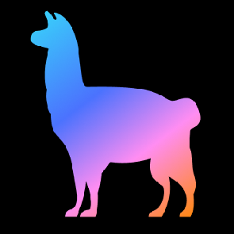
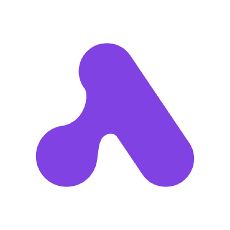

<div align="center">


**All AI Models in One API - 500+ AI Models**

[](https://www.cometapi.com/?utm_source=github&utm_medium=readme&utm_campaign=badge)

[](https://discord.com/invite/HMpuV6FCrG)
[](https://x.com/cometapi2025)
[](https://github.com/cometapi-dev)
[](https://www.youtube.com/@CometAPI-Official)

</div>

---

## 🚀 Welcome to CometAPI

CometAPI is a comprehensive AI platform that provides unified access to over **500+ cutting-edge AI models** through a single, powerful API. Our mission is to democratize AI by making the latest and most advanced artificial intelligence models accessible to developers, businesses, and innovators worldwide.

## 🌟 What Makes CometAPI Special?

### **🎯 Unified API Interface**
- Access 500+ AI models through one standardized API
- No need to manage multiple providers or learn different interfaces
- Seamless switching between models with the same codebase

### **🤖 Comprehensive Model Coverage**
- **LLM Providers**: OpenAI, Anthropic, Google, Grok, Deepseek, Alibaba, Zhipu, and many more
- **Image Generation**: DALL-E, Midjourney, Stable Diffusion
- **Video Creation**: Sora, Suno, Veo, Kling
- **Audio & Music**: Suno Music API, voice synthesis models
- **Specialized Models**: Coding assistants, translation services, OCR

*View all 500+ available models at [CometAPI Model List](https://api.cometapi.com/pricing)*

### **⚡ Real-time Model Access**
- Instant access to newly released AI models
- Stay at the forefront of AI innovation
- No delays in accessing cutting-edge capabilities

### **💰 Cost-Effective Pricing**
- **Free Tier**: $0.1 credit for new users
- **Pay-as-you-go**: Usage-based pricing
- **Enterprise Plans**: Custom solutions for scale

## 🔗 Top Integration Ecosystem

Integrate CometAPI into popular software and platforms. Access [CometAPI Console](https://api.cometapi.com/console/token?utm_source=github&utm_medium=readme&utm_campaign=integration) to get an API key.

| Platform | Description |
|----------|-------------|
|  **[Dify](https://github.com/langgenius/dify)** | Production-ready platform for agentic workflow development with AI-powered assistant features |
| 🚅 **[LiteLLM](https://github.com/BerriAI/litellm)** | Python SDK and Proxy Server to call 100+ LLM APIs in OpenAI format, supporting load balancing and fallbacks |
|  **[Langflow](https://github.com/langflow-ai/langflow)** | Low-code AI workflow builder for creating RAG and multi-agent AI applications visually |
|  **[LlamaIndex](https://github.com/run-llama/llama_index)** | Leading data framework for building LLM-powered agents and applications over your data |
|  **[Activepieces](https://github.com/activepieces/activepieces)** | Open-source AI workflow automation platform with 280+ integration pieces and MCP toolkit |
|  **[Lobe Chat](https://github.com/lobehub/lobe-chat)** | Modern open-source ChatGPT/LLMs UI with multi-modal support, MCP plugins, and agent capabilities |
|  **[Flowise](https://github.com/FlowiseAI/Flowise)** | Visual drag-and-drop tool to build AI agents and workflows with LangChain components |
|  **[RAGFlow](https://github.com/infiniflow/ragflow)** | Open-source RAG engine with deep document understanding and retrieval-augmented generation capabilities |
|  **[CAMEL-AI](https://github.com/camel-ai/camel)** | First multi-agent framework for finding the scaling laws of agents with 100+ researcher community |
|  **[Continue](https://github.com/continuedev/continue)** | Open-source AI code assistant for VS Code and JetBrains with background agents and workflow automation |
|  **[Portkey Gateway](https://github.com/Portkey-AI/gateway)** | Blazing fast AI Gateway with integrated guardrails, routing to 200+ LLMs with one unified API |

*More integrations coming soon. Have a suggestion? [Let us know](https://discord.com/invite/HMpuV6FCrG)!*

## ✨ Getting Started

### Get Your API Key
1. Sign up for a CometAPI account [CometAPI Login](https://api.cometapi.com/)
2. Visit [CometAPI Console](https://api.cometapi.com/console/token)
3. Start building with AI now!

### Quick CometAPI call
```bash
curl -X POST "https://api.cometapi.com/v1/chat/completions" \
  -H "Authorization: Bearer $COMETAPI_KEY" \
  -H "Content-Type: application/json" \
  -d '{"model": "gpt-5-mini", "messages": [{"role": "user", "content": "Hello!"}]}'
```


## 📚 Resources

### Documentation & Support
- **📖 API Documentation**: [api.cometapi.com/doc](https://api.cometapi.com/doc)
- **🚀 Quick Start Guide**: [api.cometapi.com/panel](https://api.cometapi.com/panel)
- **💰 Model Pricing Details**: [api.cometapi.com/pricing](https://api.cometapi.com/pricing)

### Community & Support
- **💬 Discord Community**: [Join our Discord](https://discord.com/invite/HMpuV6FCrG)
- **📧 Email Support**: [support@cometapi.com](mailto:support@cometapi.com)
- **🐛 Bug Reports**: Use [GitHub Discussions](https://github.com/orgs/cometapi-dev/discussions/new?category=bug-reports) in our community
- **💡 Feature Requests**: Share your ideas in our [Discord](https://discord.com/channels/1253250261124780072/1254491894952493206) or [GitHub Discussions](https://github.com/orgs/cometapi-dev/discussions)


## 🤝 Contributing

We welcome contributions from the community! Whether you're:

- **🐛 Reporting bugs**
- **💡 Suggesting features**
- **🔧 Contributing code**
- **🌟 Sharing examples**

Every contribution helps make AI more accessible to everyone.

### How to Contribute
1. Check our repositories for contribution guidelines
2. Join our Discord to discuss ideas
3. Fork, implement, and submit pull requests
4. Help others in the community

## 🎯 Our Mission

At CometAPI, we believe that access to cutting-edge AI should not be limited by technical barriers, multiple API integrations, or cost constraints. Our goal is to:

- **Simplify AI Integration**: One API for all your AI needs
- **Democratize Access**: Make advanced AI affordable and accessible
- **Foster Innovation**: Enable developers to focus on building, not integrating
- **Build Community**: Create a thriving ecosystem of AI innovators

## 📈 Join the AI Revolution

Ready to transform your projects with the power of 500+ AI models?

<div align="center">

**[🚀 Get Started Now](https://api.cometapi.com/setting) | [📖 Read the Docs](https://api.cometapi.com/doc) | [💬 Join Discord](https://discord.com/invite/HMpuV6FCrG)**

</div>

---

<div align="center">

**Built with ❤️ by the CometAPI Team**


</div>
